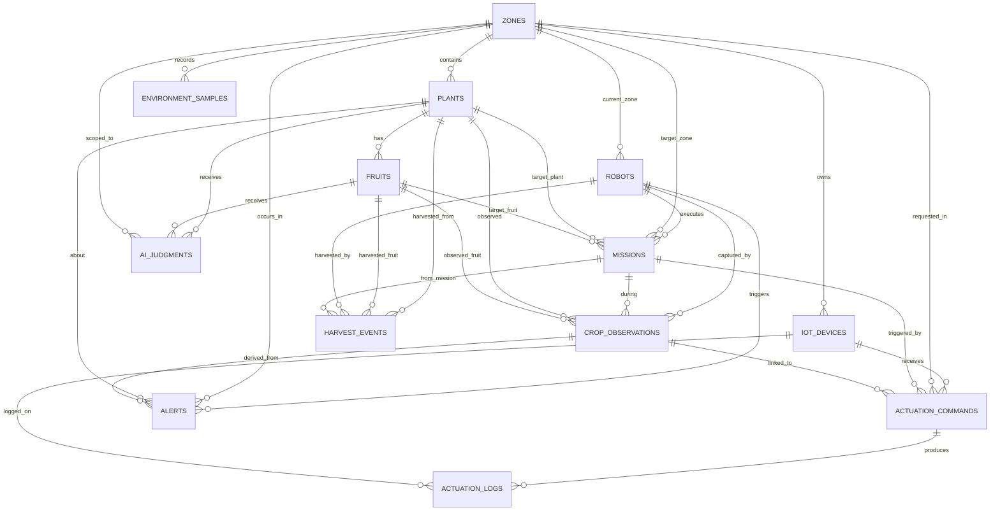

# AgriBot ERD

## 1. 문서 기준

이 문서는 현재 영속 모델인 `backend/models.py` 를 기준으로 작성한다.

- 기준 시점: `2026-04-02`
- 기준 엔티티 수: `13`
- 기준 DB 성격: 운영 조회와 이력 저장 중심의 PostgreSQL 스키마
- 제외 항목: `actuation_recommendations`, `media_assets`, 런타임 JSON 상태 파일

## 2. 엔티티 구성

| 영역 | 엔티티 | 설명 |
| --- | --- | --- |
| 공간 | `zones` | 운영 구역 기준 엔티티 |
| 로봇 | `robots` | 로봇 현재 상태 |
| 작물 | `plants`, `fruits` | 식물 및 과실 마스터 |
| 미션 | `missions` | 순찰/수확 등 로봇 미션 |
| 인지 | `crop_observations`, `ai_judgments`, `alerts` | 관측, AI 판단, 알림 |
| 환경 | `environment_samples` | 센서 이력 |
| IoT | `iot_devices`, `actuation_commands`, `actuation_logs` | 장치, 명령, 실행 로그 |
| 수확 | `harvest_events` | 수확 이벤트 이력 |

## 3. ER 다이어그램

## 4. 관계 요약

| 부모 | 자식 | 관계 | 설명 |
| --- | --- | --- | --- |
| `zones` | `plants` | 1:N | 한 구역에 여러 식물이 속한다. |
| `plants` | `fruits` | 1:N | 한 식물에 여러 과실이 속한다. |
| `zones` | `robots` | 1:N | 로봇은 현재 구역을 참조할 수 있다. |
| `robots` | `missions` | 1:N | 한 로봇이 여러 미션을 수행한다. |
| `missions` | `crop_observations` | 1:N | 미션 중 발생한 관측을 연결한다. |
| `zones` | `environment_samples` | 1:N | 구역별 환경 이력을 저장한다. |
| `zones` | `iot_devices` | 1:N | 장치는 특정 구역에 소속된다. |
| `iot_devices` | `actuation_commands` | 1:N | 장치별 제어 명령을 저장한다. |
| `actuation_commands` | `actuation_logs` | 1:N | 명령별 실행 로그를 저장한다. |
| `crop_observations` | `alerts` | 1:N | 병해 관측에서 운영 알림을 생성한다. |
| `plants` / `fruits` | `ai_judgments` | 1:N | AI 판단 결과를 식물 또는 과실 기준으로 저장한다. |
| `missions` | `harvest_events` | 1:N | 수확 이벤트를 미션과 연결한다. |

## 5. 엔티티 상세

### 5.1 공간 및 로봇

#### `zones`

| 컬럼 | 타입 | 설명 |
| --- | --- | --- |
| `id` | `string` | 구역 ID |
| `name` | `string` | 구역 이름 |
| `bounds` | `jsonb` | 구역 경계 |
| `description` | `string?` | 설명 |

#### `robots`

| 컬럼 | 타입 | 설명 |
| --- | --- | --- |
| `id` | `uuid` | 로봇 PK |
| `name` | `string` | 로봇 이름 |
| `status` | `string` | 현재 상태 |
| `battery_level` | `float?` | 배터리 잔량 |
| `current_zone_id` | `fk -> zones.id` | 현재 구역 |
| `current_pose` | `jsonb?` | 현재 pose |
| `updated_at` | `timestamp` | 갱신 시각 |

#### `missions`

| 컬럼 | 타입 | 설명 |
| --- | --- | --- |
| `id` | `uuid` | 미션 PK |
| `robot_id` | `fk -> robots.id` | 수행 로봇 |
| `mission_type` | `string` | `PATROL`, `HARVEST` 등 |
| `target_zone_id` | `fk -> zones.id?` | 대상 구역 |
| `target_plant_id` | `fk -> plants.id?` | 대상 식물 |
| `target_fruit_id` | `fk -> fruits.id?` | 대상 과실 |
| `status` | `string` | 미션 상태 |
| `progress_percent` | `int?` | 진행률 |
| `started_at` | `timestamp?` | 시작 시각 |
| `completed_at` | `timestamp?` | 완료 시각 |

### 5.2 작물 및 인지

#### `plants`

| 컬럼 | 타입 | 설명 |
| --- | --- | --- |
| `id` | `string` | 식물 ID |
| `zone_id` | `fk -> zones.id` | 소속 구역 |
| `crop_name` | `string` | 작물 종류 |
| `position` | `jsonb` | 지도 좌표 |
| `needs_water` | `bool` | 급수 필요 여부 |
| `ready_to_harvest` | `bool` | 수확 가능 여부 |
| `needs_nutrition` | `bool` | 영양 보정 필요 여부 |
| `last_observed_at` | `timestamp?` | 마지막 관측 시각 |

#### `fruits`

| 컬럼 | 타입 | 설명 |
| --- | --- | --- |
| `id` | `string` | 과실 ID |
| `plant_id` | `fk -> plants.id` | 소속 식물 |
| `position` | `jsonb` | 과실 좌표 |
| `ripeness_stage` | `string` | 숙도 단계 |
| `ready_to_harvest` | `bool` | 수확 가능 여부 |
| `current_status` | `string` | 현재 상태 |
| `last_observed_at` | `timestamp?` | 마지막 관측 시각 |

#### `crop_observations`

| 컬럼 | 타입 | 설명 |
| --- | --- | --- |
| `id` | `uuid` | 관측 PK |
| `robot_id` | `fk -> robots.id?` | 관측 로봇 |
| `mission_id` | `fk -> missions.id?` | 연관 미션 |
| `plant_id` | `fk -> plants.id` | 대상 식물 |
| `fruit_id` | `fk -> fruits.id?` | 대상 과실 |
| `finding_label` | `string` | 감지 라벨 |
| `confidence` | `float` | 신뢰도 |
| `recommended_action` | `string?` | 권장 조치 |
| `evidence` | `text?` | 근거 설명 |
| `image_url` | `string?` | 이미지 경로 |
| `observed_at` | `timestamp` | 관측 시각 |

#### `ai_judgments`

| 컬럼 | 타입 | 설명 |
| --- | --- | --- |
| `id` | `uuid` | 판단 PK |
| `plant_id` | `fk -> plants.id?` | 대상 식물 |
| `fruit_id` | `fk -> fruits.id?` | 대상 과실 |
| `zone_id` | `fk -> zones.id?` | 대상 구역 |
| `judgment_type` | `string` | `DISEASE`, `RIPENESS`, `HARVEST_DECISION` |
| `model_name` | `string` | 모델 이름 |
| `model_version` | `string` | 모델 버전 |
| `raw_label` | `string` | 원본 라벨 |
| `canonical_code` | `string` | 정규화 코드 |
| `confidence` | `float` | 신뢰도 |
| `risk_level` | `string?` | 위험도 |
| `recommended_action_code` | `string` | 권장 조치 코드 |
| `requires_approval` | `bool` | 승인 필요 여부 |
| `payload_json` | `jsonb` | 추가 메타데이터 |
| `image_url` | `string?` | 이미지 경로 |
| `created_at` | `timestamp` | 생성 시각 |

#### `alerts`

| 컬럼 | 타입 | 설명 |
| --- | --- | --- |
| `id` | `uuid` | 알림 PK |
| `robot_id` | `fk -> robots.id?` | 연관 로봇 |
| `zone_id` | `fk -> zones.id?` | 연관 구역 |
| `plant_id` | `fk -> plants.id?` | 연관 식물 |
| `observation_id` | `fk -> crop_observations.id?` | 원천 관측 |
| `alert_type` | `string` | 알림 타입 |
| `severity` | `string` | 심각도 |
| `message` | `text` | 메시지 |
| `image_url` | `string?` | 이미지 경로 |
| `acknowledged_at` | `timestamp?` | 읽음 시각 |
| `acknowledged_by` | `string?` | 읽음 처리자 |
| `detected_at` | `timestamp` | 탐지 시각 |

### 5.3 환경 및 IoT

#### `environment_samples`

| 컬럼 | 타입 | 설명 |
| --- | --- | --- |
| `id` | `uuid` | 샘플 PK |
| `zone_id` | `fk -> zones.id` | 측정 구역 |
| `temperature` | `float?` | 온도 |
| `humidity` | `float?` | 습도 |
| `soil_moisture` | `float?` | 토양 수분 |
| `recorded_at` | `timestamp` | 기록 시각 |

#### `iot_devices`

| 컬럼 | 타입 | 설명 |
| --- | --- | --- |
| `id` | `string` | 장치 ID |
| `zone_id` | `fk -> zones.id` | 소속 구역 |
| `device_type` | `string` | `WATER_PUMP`, `NUTRIENT`, `SPRINKLER` |
| `display_name` | `string` | 표시 이름 |
| `control_mode` | `string` | 제어 모드 |
| `current_state` | `string` | 현재 상태 |
| `current_value` | `float?` | 현재 값 |
| `value_unit` | `string?` | 단위 |
| `is_online` | `bool` | 온라인 여부 |
| `last_seen_at` | `timestamp?` | 마지막 확인 시각 |

#### `actuation_commands`

| 컬럼 | 타입 | 설명 |
| --- | --- | --- |
| `id` | `uuid` | 명령 PK |
| `device_id` | `fk -> iot_devices.id` | 대상 장치 |
| `zone_id` | `fk -> zones.id` | 대상 구역 |
| `mission_id` | `fk -> missions.id?` | 연관 미션 |
| `observation_id` | `fk -> crop_observations.id?` | 연관 관측 |
| `command_type` | `string` | 논리 명령 타입 |
| `command_status` | `string` | 명령 상태 |
| `target_value` | `float?` | 목표값 |
| `value_unit` | `string?` | 단위 |
| `requested_by` | `string?` | 요청자 |
| `request_source` | `string?` | 요청 출처 |
| `requested_at` | `timestamp` | 요청 시각 |

#### `actuation_logs`

| 컬럼 | 타입 | 설명 |
| --- | --- | --- |
| `id` | `uuid` | 로그 PK |
| `command_id` | `fk -> actuation_commands.id` | 원본 명령 |
| `device_id` | `fk -> iot_devices.id` | 대상 장치 |
| `result` | `string` | 성공/실패 결과 |
| `result_message` | `text?` | 상세 메시지 |
| `state_after` | `string?` | 실행 후 상태 |
| `actual_value` | `float?` | 실제 값 |
| `value_unit` | `string?` | 단위 |
| `started_at` | `timestamp` | 시작 시각 |
| `finished_at` | `timestamp?` | 종료 시각 |

### 5.4 수확

#### `harvest_events`

| 컬럼 | 타입 | 설명 |
| --- | --- | --- |
| `id` | `uuid` | 수확 이벤트 PK |
| `plant_id` | `fk -> plants.id` | 대상 식물 |
| `fruit_id` | `fk -> fruits.id?` | 대상 과실 |
| `robot_id` | `fk -> robots.id` | 수행 로봇 |
| `mission_id` | `fk -> missions.id?` | 연관 미션 |
| `success` | `bool` | 성공 여부 |
| `fail_reason` | `text?` | 실패 사유 |
| `basket_count` | `int?` | 바구니 수량 |
| `harvested_at` | `timestamp` | 수확 시각 |

## 6. 구현상 유의사항

- `actuation_recommendations` 는 별도 테이블이 아니라 운영 상태에서 계산되는 파생 데이터다.
- 로봇 제어 상태, 미션 상태, 수확 상태 일부는 DB보다 런타임 JSON 파일이 우선이다.
- `ai_judgments` 는 식물, 과실, 구역 중 일부만 참조할 수 있으므로 nullable foreign key를 사용한다.
- `missions`, `actuation_commands`, `alerts` 는 운영 흐름 연결을 위해 다수의 선택적 FK를 가진다.
