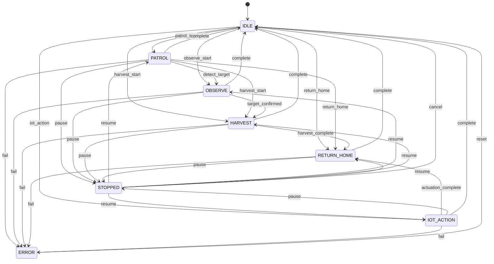

# Mission State Diagram

`S14P-402` 기준선용 미션 상태머신 초안입니다.

## 구현 메모

- 로봇 모드는 API 문서의 `robot.status` enum을 기준으로 맞춘다.
- 미션 상태는 API 문서의 `missions.status` enum을 기준으로 맞춘다.
- `S14P-403`부터는 `/mission/command`가 `/patrol/start`, `/patrol/stop`, `/patrol/resume` 서비스 호출로 이어진다.
- `MissionStatus`와 `RobotStatus`는 `patrol/status`를 받아 순찰 진행률과 중지/재개 상태를 같이 반영한다.
- 수확 액션 서버와 IoT 실행 연동은 `S14P-453`, `S14P-5xx` 이후 단계에서 이어 붙인다.
